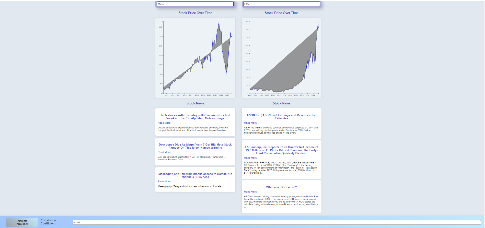

## Correlation Calculator

This web-based application allows users to calculate the Pearson correlation coefficient between two stock tickers over time. Alongside the correlation, the app provides visual charts of stock prices over time and recent news articles related to each stock.

You can find the calculator here (https://akashpulluru.github.io/Asset_Price_Analysis/)

Application Interface: 

### Features:

- **Correlation Calculation:** Calculates the Pearson correlation coefficient for two stocks.
  
- **Stock Price Over Time:** A visual representation of each stock's price over time using D3.
  
- **Stock News:** Displays recent news articles for each stock.

### Usage:

1. Navigate to the Correlation Calculator page.
2. Input two stock tickers in the designated input fields.
3. View the respective stock's price over time and recent news articles.
4. Click the "Calculate Correlation" button to view the Pearson correlation coefficient between the two stocks.

### Technical Details:

- The front-end is written in **HTML** and **CSS**.
  
- The back-end logic is written in **JavaScript**. The primary classes are `Calculator`, `Stocks`, and `View`.
  
- Uses **Axios** for making API requests.
  
- Uses **D3** for visualizing stock prices over time.
  
- API calls are made to `www.alphavantage.co` to fetch the monthly time series of stock prices and recent news articles.

### Code Examples

### Saving Stock Price Data: 
async getPrices() {
        this.storedData = await this.getData();
        if (!this.storedData) return;
        
        let closingPrices = [];
        
        for (let date in this.storedData["Monthly Time Series"]) {
            closingPrices.push(parseFloat(this.storedData["Monthly Time Series"][date]['4. close']));
        }
        return closingPrices;
    } 

### Displaying News: 
displayNews(newsData) {
        let articleNumber = 3;
    
        // Update the target element for the news
        const container = select(`#${this.newsId}`);
        
        // Removes any previous data.
        container.selectAll('*').remove();  
        
        newsData.feed.slice(0, articleNumber).forEach(newsItem => {
            const newsTile = container.append('div').attr('class', 'news-tile');
            newsTile.append('h3').text(newsItem.title);
            newsTile.append('a').attr('href', newsItem.url).text('Read More');
            newsTile.append('p').text(newsItem.summary);
        });
    }

### Correlation Calculation: 
async calculateCorrelations() {
        //uses get prices method to get prices for each individual ticker
        const stock1Prices = await this.stock1.getPrices();
        const stock2Prices = await this.stock2.getPrices();

        //checks that stock data is formatted appropriately 
        if (!stock1Prices || !Array.isArray(stock1Prices) || !stock2Prices || !Array.isArray(stock2Prices)) {
            console.error("One or both of the stock prices data is invalid.");
            return null;
        }

        //trims the longer array to be an equivelant time series to the shorter array
        const minLength = Math.min(stock1Prices.length, stock2Prices.length);
        const trimmedStock1Prices = stock1Prices.slice(0, minLength);
        const trimmedStock2Prices = stock2Prices.slice(0, minLength);

        //length of shorter array
        const n = trimmedStock1Prices.length;

        //gets cumulative stock prices for each ticker using an accumulator
        const sumX = trimmedStock1Prices.reduce((acc, value) => acc + value, 0);
        const sumY = trimmedStock2Prices.reduce((acc, value) => acc + value, 0);

        //gets cumulative stock prices for both tickers added together using an accumulator
        const sumXY = trimmedStock1Prices.reduce((acc, value, index) => acc + value * trimmedStock2Prices[index], 0);

        //gets sum of both values
        const sumX2 = trimmedStock1Prices.reduce((acc, value) => acc + value * value, 0);
        const sumY2 = trimmedStock2Prices.reduce((acc, value) => acc + value * value, 0);

        //creates numerator of pearson correlation 
        const numerator = n * sumXY - sumX * sumY;

        //creates denominator of pearson correlation
        const denominator = Math.sqrt((n * sumX2 - sumX ** 2) * (n * sumY2 - sumY ** 2));

        const correlation = numerator / denominator;

        if (!isNaN(correlation)) {
            return correlation;
        } else {
            console.error("Couldn't calculate the correlation coefficient.");
            return null;
        }
    }

### External Dependencies:

- Axios
- D3

### Author:

- [Akash Pulluru](https://www.linkedin.com/in/akashpulluru)

